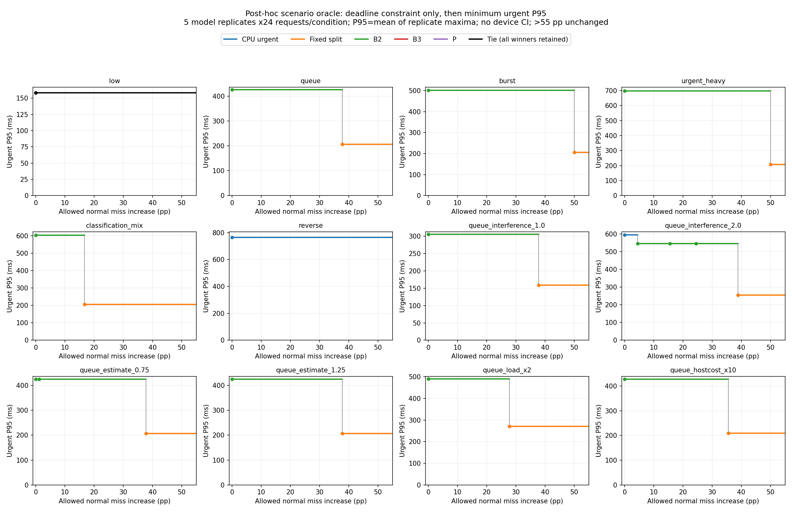

# 일반 서비스 허용폭에 따른 정책 선택

작업 `ARRIVAL-DELTA-SELECTION-01`, 2026-09-25. 시작 `feature/arrival-scheduling-20260923` / `b7a4695d3f1241e8a184290ad9a95ff49e314cd7`, clean. [직전 서비스 비교](ARRIVAL_SERVICE_COMPARISON_20260925.md)의 CSV를 재사용한 **사후 탐색**이다. 추가 실측, P 튜닝, B2 재선정, 전체 배치 및 개별 시뮬레이션 재생 모두 0회다.

**δ=0%p에서 B2가 9조건, CPU 긴급우선이 2조건의 단독 최선이다. low에서는 CPU 긴급우선·고정 분리·B3·P가 동률이다. δ를 늘리면 선택이 바뀌지만 P가 단독 선택되는 조건·구간은 없다.** 현재 P는 재현·제거 비교용으로 보존하고 성능 개선 후보로 추가 튜닝할 근거는 부족하다. 간섭 인지 정책 일반의 가능성을 부정하는 결론은 아니다.

## 이번 질문과 기존 계약의 관계

후보는 직전 주 비교의 다섯 정책을 그대로 사용한다: CPU_URGENT, FIXED_SPLIT(urgentCPU/normalGPU), B2_PC, B3_SOLO_EFT_PC, P_PAIR_COST_PC. FIFO·제거군은 이번 주 선택 후보가 아니며 기존 결과에 그대로 보존한다. P에 유리하게 후보를 추가·삭제하지 않는다. 아래 B2는 개발에서 고정한 **분류GPU/탐지CPU 병행** 하나다. 평가 조건별 정적 배정 재선정은 없다. strict CPU fallback과 섞지 않고 **explore 모드 12조건**을 비교한다.

이번 사용자 지정 기준은 다음과 같다.

```
일반 위반율(policy) ≤ 일반 위반율(CPU_URGENT) + δ, δ ≥ 0 (%p)
위 조건을 만족하는 후보 중 긴급 P95 최소
```

이전 후처리 `select()`의 일반 평균응답 손실 제약 및 긴급 위반율 우선 정렬은 **이번 질문과 다르므로 호출하지 않는다.** 일반 평균·긴급 위반율은 보고하되 새 제약이나 동률 해소 기준으로 추가하지 않는다. 동일한 원 데이터의 서로 다른 선택 질문이지 기존 결과 수정이 아니다. 이미 합의된 새 일반 서비스 margin은 없고, 과거198요청 실험의 결합 FAIL/10% 최소효과는 해당 실험에 보존한다. 현재 완료·분모 적격성 조건도 유지한다.

동률은 CSV에 보존된 긴급 평균값을 Decimal로 비교하여 같은 후보를 **모두** 남긴다. 단순 정책 우선 등 미합의 규칙으로 동률을 없애지 않는다. 표시는 반올림하되 제약은 정수 건수의 Fraction으로 계산한다.

## 분모와 시간 정의

- 정책·조건마다 같은 5모델반복×24요청=120 planned/arrived/완료다. 일반 분모90·긴급30이고 urgent_heavy만 일반60·긴급60이다. 조건별·정책별 분모 일치를 검사했다. 이 반복 수는 실측 독립 세션 수가 아니다.
- 일반 위반은 `1−기한 내 응답 수/전체 일반 planned`다. 늦은 성공·기한 내 응답 없는 요청이 포함되며 완료 요청만을 분모로 삼지 않는다. 현재 입력은 전 요청 완료라 미완료·미도착0이다. 실패·거절·강제 만료 과정은 미모델링이므로 실제 실패율0을 뜻하지 않는다. 향후 미완료/누락된 priority별 ledger가 있는 집계를 이 도구에 넣으면 지연 제약 선택에서 비교 불가로 제외하며 성공으로 채우지 않는다.
- urgent 응답은 예정 도착→output_ready, normal은 예정 도착→persist_complete다. 기존 기한 긴급1500ms/일반6000ms는 시나리오이며 UX SLA가 아니다. makespan은 첫 예정 도착→마지막 lane_available이다.
- 긴급 P95는 **반복별6건(urgent_heavy12건)의 nearest-rank 최댓값을 구한 뒤 5반복 평균**이다. 조건 pooling P95·모집단 tail·실기기 CI가 아니다. 일반평균도 반복 평균이다. 이번 입력에는 누락/비교 불가가 없었다.
- 차이는 상대 증가율(%)이 아닌 **위반율 차이(%p)**다. `Δ=100(m_policy/n−m_CPU/n)`, 필요한 최소 허용폭은 `max(0,Δ)`다. 예컨대 26/90→30/90의 경계는 정확히 **40/9%p**, 표시4.444%p는 그보다 작다. 코드에서 반올림된 경계를 판정에 사용하지 않는다.

## δ=0과 실제 선택 전환점

아래 CPU 위반율은 기준정책의 값이다. `고정`은 FIXED_SPLIT이며 B2와 다르다. 경계 이상에서 새 정책이 선택되고, 다음 경계 미만까지 유지된다. low 동률을 제외한 모든 선택은 단독 최저다.

| 조건 | CPU 일반 위반 건/분모 (율%) | δ=0 선택·긴급ms | δ 증가에 따른 최선 전환(%p) |
|---|---:|---|---|
| low | 0/90 (0) | CPU·고정·B3·P 동률 158.365 | 변화 없음 |
| queue | 26/90 (28.889) | B2 425.889 | 340/9≈37.778 → 고정206.911 |
| burst | 15/90 (16.667) | B2 501.831 | 50 → 고정205.581 |
| urgent_heavy | 0/60 (0) | B2 698.899 | 50 → 고정206.911 |
| classification_mix | 0/90 (0) | B2 603.766 | 50/3≈16.667 → 고정205.486 |
| reverse | 0/90 (0) | CPU 764.432 | 변화 없음 |
| queue_interference_1.0 | 26/90 (28.889) | B2 305.690 | 340/9≈37.778 → 고정159.200 |
| queue_interference_2.0 | 26/90 (28.889) | CPU 595.494 | 40/9≈4.444 → B2 546.088; 350/9≈38.889 → 고정254.622 |
| queue_estimate_0.75 | 26/90 (28.889) | B2 425.889 | 340/9≈37.778 → 고정206.911 |
| queue_estimate_1.25 | 26/90 (28.889) | B2 425.889 | 340/9≈37.778 → 고정206.911 |
| queue_load_x2 | 40/90 (44.444) | B2 490.882 | 250/9≈27.778 → 고정270.390 |
| queue_hostcost_x10 | 28/90 (31.111) | B2 428.589 | 320/9≈35.556 → 고정209.611 |

위 표는 최선의 전환만 요약했다. **최선이 바뀌지 않는 자격 진입 경계**도 [전체 구간 표](results/arrival_delta_selection_20260925/interval_table.md)에 남겼다. 간섭2 조건의 B3 140/9%p·P220/9%p, 추정0.75 조건의P10/9%p가 해당한다. [thresholds.csv](results/arrival_delta_selection_20260925/thresholds.csv)는 각 정책의 정확한 Δ/최소δ/절대성능/분모를, [intervals.csv](results/arrival_delta_selection_20260925/intervals.csv)는 구간별 가용 집합·동률 전체·선택자의 일반평균/완료율/긴급 위반 건수와 정확한 비율을 제공한다. 따라서 단순히 표의 승자만 보고 나머지 후보를 비교 불가라고 해석하지 않는다.

예를 들어 기본queue에서 δ<340/9일 때 B2(일반4138.670ms, 위반20/90, 전체완료120/120, 긴급위반0/30), 그 이상에서는 고정 분리(일반8715.255ms, 위반60/90, 전체완료120/120, 긴급위반0/30)가 선택된다. 허용폭을 크게 늘리면 긴급 이득을 위해 일반 서비스가 상당히 악화될 수 있다. **이를 허용하자는 권고가 아니다.** low의 동률 후보 중 고정 분리의 일반평균1132.251ms는 나머지621.707ms보다 크지만, 이번 목적에 없는 일반평균으로 동률을 해소하지 않았다.



계단은 시나리오별 결과를 모두 본 뒤 선택한 **사후 최선/oracle 참고값**이다. 실제 도착 시 미리 조건을 식별하는 정책의 성능이 아니다. 가용 후보가 늘어날 때 최선 P95는 증가하지 않는다. 검은 선은 동률이며 모든 이름은 표/CSV에 있다. 마지막 임계값은50%p로 그림은55까지 표시했고 그 이후 값은 같다. 오차막대·유의성·실기기 성능 보장은 부여하지 않는다.

## 모든 조건에 하나의 정책을 고정하는 경우

확률·가중치가 사전 정의되지 않았으므로 12조건을 임의로 평균해 최종 승자를 만들지 않는다. 기존 개발 단계의 평균 목적은 B2 선정에만 해당하며 평가의 시나리오 발생 확률이 아니다.

| 고정 정책 | 모든 조건에 필요한 최소δ %p | 제한을 결정한 조건 | 최악 긴급 P95 ms·조건 |
|---|---:|---|---|
| CPU 긴급우선 | 0 | 모든 조건에서 기준 자체 | 830.361 / 준비·callback2배 |
| B2 | 40/9≈4.444 | 간섭2 | 936.798 / 역할반전 |
| B3 | 140/9≈15.556 | 간섭2 | 1608.239 / 역할반전 |
| P | 220/9≈24.444 | 간섭2 | 1467.995 / 역할반전 |
| 고정 urgentCPU/normalGPU | 50 | burst·urgent_heavy | 936.798 / 역할반전 |

전체 제약 충족 집합은 `[0,40/9): CPU`, `[40/9,140/9): CPU+B2`, `[140/9,220/9): CPU+B2+B3`, `[220/9,50): CPU+B2+B3+P`, `[50,∞): 5정책 모두`다. 각 고정 정책의 **조건별12개 긴급P95**와 최악 조건은 [global_policies.csv](results/arrival_delta_selection_20260925/global_policies.csv), 구간별 집합은 [global_intervals.csv](results/arrival_delta_selection_20260925/global_intervals.csv)에 있다.

CPU 긴급우선은 모든 δ에서 가용하고 최악 긴급값도 가장 작다. 이는 **최악값만을 기준으로 했을 때의 기술적 비교**다. minimax 목표를 채택하거나 모든 조건의 CPU 우세를 주장하지 않는다. B2는 기본 큐·burst·긴급 비중 증가 등에서 더 짧은 긴급 P95를 내지만 low·reverse에서는 CPU보다 느리고, 간섭2에서는 일반 제약에 추가 허용이 필요하다. 고정 분리는 큰 일반 손실을 허용하면 10개 조건에서 B2를 대체하지만 역할반전에서는 CPU에 밀린다.

## P의 역할과 간섭 가정

**P는 δ≥0 어디에서도 단독 최선이 아니다.** low의 4자 동률만 있으며 해당 조건은 간섭 penalty가 필요한 정책 차이를 보이지 않는다. CPU 긴급우선은 정의상 모든 δ에서 가용하고, 그 긴급 P95는 12조건 모두 P 이하(low 동률·나머지11조건 엄격히 작음)다. 따라서 이번 후보 집합·제약·목적에서는 P가 단독 선택될 수 없다. 이는 P가 모든 서비스 지표에서 CPU에 지배된다는 뜻은 아니다.

| 조건 | P 긴급P95 손실 vsCPU ms | P 일반 위반 건수 차이/분모 | 위반율 차이 %p |
|---|---:|---:|---:|
| queue | +418.522 | −9/90 | −10 |
| 간섭1(예측1.5) | +125.415 | −26/90 | −260/9≈−28.889 |
| 간섭2(예측1.5) | +870.893 | +22/90 | +220/9≈+24.444 |
| 추정0.75 | +210.195 | +1/90 | +10/9≈+1.111 |
| 준비·callback2배 | +101.600 | −11/90 | −110/9≈−12.222 |

P가일반위반을더줄이는조건은있으나 이번목적은상한충족후긴급P95최소이며, 상한보다더낮은위반을추가보상하지않는다. 예를들어queue의P는B2보다일반위반3/90건(3.333%p)을줄이는대신긴급P95가588.127ms늘어난다. 그교환을선호하려면다른서비스요구가필요하며P를살리려고이번목적을바꾸지않는다. [P_comparisons.csv](results/arrival_delta_selection_20260925/P_comparisons.csv)는12조건의CPU 및δ0승자와절대차를제공한다.

P의예측간섭계수는전조건1.5고정이고, 실현은기본1.5·별도조건1/2다. 둘다 **미검증 가정**이며실측인과계수가아니다. 실제간섭없음가정에서불필요대기, 더큰간섭가정에서서비스손실이있다는기존해석을유지한다. 이번작업은trace를다시돌리거나P를수정하지않았다. 더정확한간섭모형이나다른요구아래의간섭인지정책일반을검증한것은아니다.

## 결론과 다음 최소 작업

1. 보수적인 탐색점 δ0에서 B2는 9조건의 단독 최선이지만, 전체 조건에 하나를 고정하면 CPU만 현재 제약을 충족한다.
2. 허용폭 증가는 10조건의 최선을 바꾼다. 주로 일반 서비스 손실이 큰 고정 분리가 선택되며, 간섭2에서는 먼저 B2가 진입한다. low/reverse는 변하지 않는다.
3. 현재 P를 재현·기여 분리 자료로 보존할 이유는 있으나, 이 목적에서 성능 후보로 계속 튜닝할 근거는 없다. **현재 P 추가개발 보류 권고를 유지한다.** 최종 프로젝트 목표 변경이나 간섭 인지 연구 전체 중단은 자동 채택하지 않는다.
4. 다음 최소 작업은 **모든 조건에서 같은 δ를 요구하는지와 실제 일반 위반 증가 허용폭을 요구사항으로 결정**하는 것이다. 하나의 사용자 결정으로 요약하면 “일반 위반율 증가를 어디까지 허용할 것인가”다. δ0도 아직 합의된 서비스 기준이 아니다. 시나리오 확률 또는 최악값 목적이 없으면 단일 최종 정책을 강제 선정하지 않는다. 새 실측·새 정책을 자동 제안하지 않는다.

이분석은이미본평가자료의사후선택이며새평가가아니다. 단독CAL-03기반벡터, 가정병행·비용·부하이전이라는경계를유지한다. 실제Android P/B3·선정B2역방향병행·독립평가·기존시스템비교는미완료다. 기존FAIL·부분결과·40동결값·20null·종료계획·`experiment_ready=false`를유지한다.

## 파일·재현·검증

[산출물 안내](results/arrival_delta_selection_20260925/README.md), [후처리 코드](../tools/d1_arrival_delta_selection.py), [작은 테스트](../tools/test_d1_arrival_delta_selection.py). 입력은저장소의기존`absolute.csv`하나이므로외부실측로그없이도재현가능하다. 원래설정은 [동결설정](results/arrival_explore_20260925/freeze_before_evaluation.json) 및 [시나리오계약](results/arrival_explore_20260925/contract_before_development.json)을참조한다. 입력hash·소스checkpoint·목적·후보·정확계산규칙은새receipt에있다.

```powershell
python -B -m unittest tools.test_d1_arrival_delta_selection -v
python -B -m tools.d1_arrival_delta_selection --output C:/Users/LG/Documents/D1Check_Arrival_Extension/arrival_delta_selection_reproduced_v1
```

새output만허용하며시뮬레이터나ADB를호출하지않는다. 실제실행산출은외부`arrival_delta_selection_v1`, 공유복사본은위결과폴더다. 신규PC4테스트통과: 정확경계의포함/미만, 동률보존과기존정렬미적용, 미완료를planned분모에포함·불완전집계차단, 음수차이와δ0. 기존테스트/빌드/감사반복없음. PNG직접검토·SVG제공·입력보존확인·링크/diff검증의대상hash와시점은VERIFICATION에남겼다.
