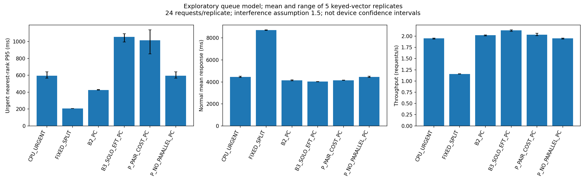
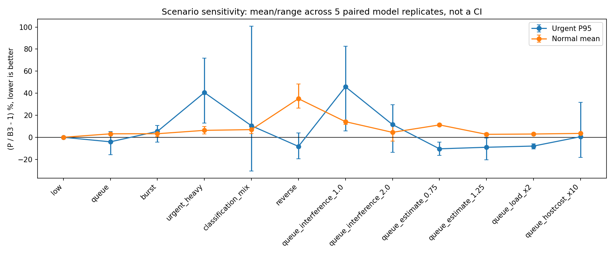
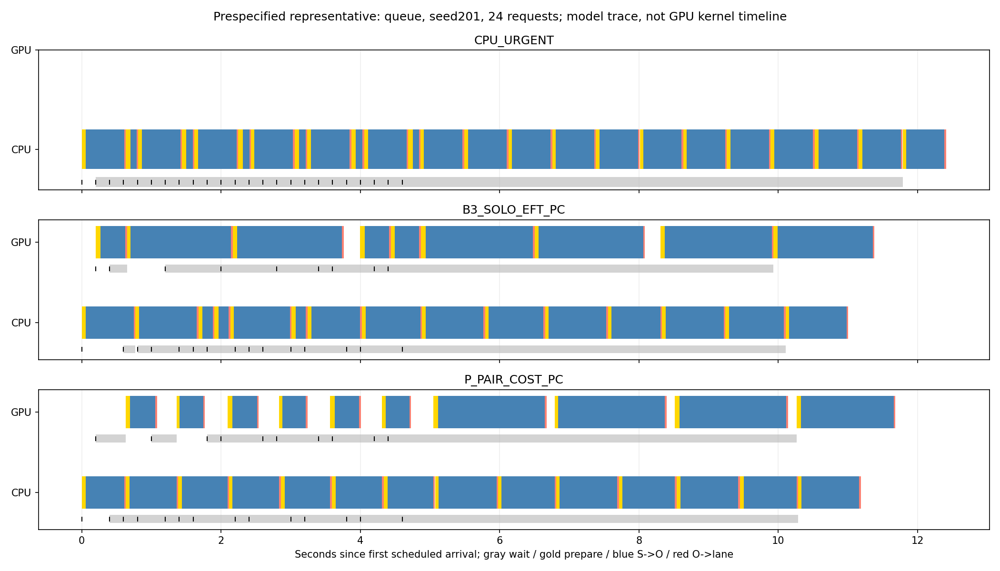

# 확인 실측과 PC 탐색 비교 결과

시작 `983d3b2`/clean, 브랜치 `feature/arrival-scheduling-20260923`. 사용자 승인으로 확인 전용 1계획을 실행하고 PC 시뮬레이터·비교를 완성했다. **실측 3세션은 기술적으로 완료됐지만 정책 우월성·예측 정확도 PASS는 없다. `experiment_ready=false`를 유지한다.** 기존 198요청 주 결합 FAIL, fixed-split 부분 결과, CAL-03 동결40값/기존20null, 종료 계획과 과거 원인 미확정을 보존한다.

## 실기기 실행과 소비

- 실행 ID `ARRIVAL-CONFIRM-FOLLOWUP-01`. 준비 v3에서 배터리 기준만 사용자의 후속 지시에 따라 시작55/실행중30%에서20%로 변경해 **미소비 상태의 v4**에 고정했다. 새 계획을 여러 번 실행한 것이 아니다. 계획 SHA `365e16cf8a811e17b0b7c83f7b1fbd34ef87a58dc76d561f9f46e3b2e07d4bd0`.
- 현재 기기는 wireless serial `adb-R59W802RW5F-yZ5QCN._adb-tls-connect._tcp`, 하드웨어 serial R59W802RW5F/SM-A245N. fingerprint·설치 APK `d8db6963…34bc`·프로젝트 서명·package/version 일치. 시작52%/32.5°C, 세션 직전51%/32.5~32.6°C/비충전, thermal0, awake/interactive, 밝기81/수동/기존5시간 timeout 일치. 앱 memory admission/low_memory 검증 통과. 표본 사이 환경은 연속 관측한 것으로 주장하지 않는다.
- 서버 정상 응답, 다른 수집 실행 없음. 서버 시작/재시작·재연결0, 설치·APK전송0, 화면/기기 설정 변경0. 입력/manifest staging은 수행했다. 정상 서버를 재시작하지 않았다.
- **3시도/3완료/실패0/미시도0, 진단12·warmup24·명시적 추론36, retry·대체·추가0.** 원래 부분 계획의 실패1·미시도2는 그대로 남는다.
- 수집 runner492.687초, 사전 연결 확인부터 최종 host cleanup까지561.360초(9.356분), 냉각360초 포함. 준비된 수집 상한1800초 및 사용자 전체 상한2700초 안이다. 별도 PC 분석 시간은 기기 예산이 아니다.
- 세션별 앱 cleanup3/3, host force-stop/프로세스 부재3/3. 마지막 명령은 thermal 조회였고 이후 추가 기기 호출은 없다. 원본에서 재생한 실제 lane 재사용은8쌍, F의 host API overlap은35.675/35.831ms 두 쌍이다. kernel 실행 구간이나 인과 간섭계수로 해석하지 않는다.
- 실기기 완료 후 **PC 요약기만 실패**했다. 기존 `summarize()`의6조건 검사를 후속3조건에도 적용한 결함이다. 실행/완료 receipt와 원자료를 그대로 보존하고, `followup-exact-installed-v1`만 정확한3조건 집합을 요구하도록 수정했다. 기존6조건 및 부분 결과 거절 규칙을 테스트했다. 기기 재실행은 하지 않았다.

| 이번 후속 조건 | 독립 세션/진단 | 개발 동결 대비 D→dispatch 중앙값 차이 | S→O 중앙값 차이 |
|---|---:|---:|---|
| B CPU shadow·단독 | 1/4 | +0.820ms | 분류CPU urgent −1.801ms, 탐지CPU normal −0.109ms |
| A CPU active·단독 | 1/4 | −0.352ms | 분류CPU urgent −0.345ms, 탐지CPU normal −4.320ms |
| F 고정분리·병행 큐 | 1/4 | −0.227ms | 분류CPU urgent +0.619ms, 탐지GPU normal +3.813ms |

개발6세션/동결 SHA `e4cb73aa1045f4b6ff5a17aa500862799c6f55bb07de5ab36e2fba580b683023` 불변. 이전 확인 E/D/C와 새 B/A/F는 조건별 기술통계로만 연결한다. 날짜·순서·host 계측·배터리 허용범위가 다르며 원래 계획의6/6 완주 또는 동일 시기 paired 실험으로 합치지 않는다. 각 조건1세션·task별2상관요청이다. 사전 수치 정확도 허용폭이 없어 오차를 PASS로 승격하지 않는다.

## 실제 연결한 기능과 근거 경계

[관측 bridge](../tools/d1_arrival_observed_bridge.py)는 새3세션의 정확한 request/backend/순서로 A→S→O→P→W→L을 재생한다. urgent의 O와 normal의 P 응답 경계, busy lane 재사용, 전체구간 합을 검사한다. 판단 비용은 snapshot 준비·계산·선택·기록·record→dispatch의 **요청별 서로 겹치지 않는5구간**으로 보존하고, 합산 후 전체 중앙값을 낸다. 구간 중앙값을 합쳐 전체 중앙값이라고 하지 않는다.

연결 범위는 **조건별 관측 비용 조회·실측 trace 재생**이다. 이 자료로 가상의 다른 배정 결과를 생성하거나 P의 Android 계산 비용을 검증했다고 하지 않는다. 현재 Android active는 strict CPU fallback이며 새 PC B3/P와 다르다. 관측 F의 병행은 그대로 재생할 수 있지만, 임의 도착/부하/반대 task 배정의 병행 허용 근거는 아니다.

새 PC [엔진](../tools/d1_arrival_explore.py)은 기존 CAL-03 변환·priority별 개발 중앙값 및32개 요청의 공동 구간 벡터를 재사용한다. 원 fit/확인 자료를 재튜닝하지 않았다. 실측 자료 기반 단독 비용과 새 workload로 옮기는 가정은 분리한다.

| 실행 모드 | 가능한 것 | 불가능/가정 |
|---|---|---|
| measured-only bridge | 정확한 기록 순서·응답·점유 재생 | 반사실적 정책 성능/독립 예측 검증 |
| strict PC | 전체 직렬, 고정 경로 비교, 적응 경로는 CPU fallback | 새 큐/도착으로의 비용 전이와 공통 판단 비용은 여전히 가정. 순수 실측 결과가 아님 |
| explore PC | CPU/GPU lane별 비선점·병행 민감도와 정책 비교 | S→O 겹침 감속·미측정 조합·부하 비용은 명시적 가정. 기기 지원 승인 아님 |

예상시간은 개발 point estimate이고 엔진 실현시간은 별도 벡터다. seed/request/backend hash로 벡터를 선택하므로 정책 RNG 호출순서에 영향받지 않는다. 이는4상관요청의 재사용이지 검증된 분포 적합이 아니다. 엔진만 실현값/미래 도착을 보유하고 정책 API는 도착 큐·현재 phase·개발 예상값만 받는다.

서비스 구간은 **S→O 전체**이며 순수 inference/kernel 시간이 아니다. explore의 rate는 두 lane이 S→O 중일 때만 `1/interference`이며, 상대 lane 진입/이탈 때 남은 work에 새 rate를 적용한다. 준비·저장·worker release·lane release는 별도다. 판단/기록/dispatch 비용은 한 번씩만 더한다. 선택 없는 호출 비용도 scheduler 시간을 소비하되 busy polling하지 않는다. 실제 L 이전에는 lane을 해제하지 않는다. 추정 종료 초과는 UNKNOWN_OVERRUN이며, P는 미확정 상대 피해를0으로 치환하지 않고 병행 비용 판단을 보류한다.

동시각 규칙은 CPU/GPU phase·L → 도착 ordinal/ID → 진행 중 판단 완료·dispatch → 새 판단이다. 같은 lane의 실행은 비선점이며 120초 horizon의 대기/실행/미도착 요청도 planned 분모에 보존한다. 종료가 늦으면 makespan/throughput은null이다. 실패·거절·강제 만료의 확률모형은 **미지원**이며 0발생률을 추정하지 않는다. 성공 벡터 모델에서 모든 요청 완료는 실기기 신뢰성 증거가 아니다.

## 정책과 동결

모든 정책은 새 PC namespace이며 Android 정책 ID/구현/과거 결과를 변경하지 않았다.

| PC 정책 | 실제 구현 | PLAN 대비 범위 |
|---|---|---|
| CPU_FIFO / CPU_URGENT | CPU 직렬 FIFO / urgent 우선·등급내FIFO | 기존 순서 기준. aging을 새로 넣지 않음 |
| FIXED_SPLIT | urgent CPU, normal GPU, 가능한 lane에 우선순위순 배정 | 기존 고정 분리 규칙. strict에서는 전체 직렬 |
| B2_PC | task별4배정×직렬/병행 최대8후보를 개발에서 고정 | strict는4직렬후보. thermal pacing·실기기 최적성 미검증 |
| B3_SOLO_EFT_PC | 공통 urgent/EDF/aging4초 후 단독 응답+busy 잔여의 최소 예상값 | 준비/응답 경계 포함, 간섭 보정 없음. CPU fallback strict 모드와 구분 |
| P_PAIR_COST_PC | B3에 예상 병행 지연+실행 중 상대 요청 피해를 더해 시작/대기 | 단순 개발 후보이며 PLAN P 전체·독창성 입증 아님 |
| P_NO_PAIR_COST_PC / P_NO_PARALLEL_PC | 간섭 비용 제거 / 병행 금지 | 전자는 B3와 같은 결정, 후자는 공통 aging을 유지한 직렬 |

P의 후보 비용은 `R_backend + reply + (k−1)·service + (k−1)·R_other`이며 마지막 두 항은 상대 lane이 S→O 중일 때만 적용한다. k=1.5는 **고정 탐색 가정**이며 실측에서 추정한 계수가 아니다. 정책에는 실제 미래 residual을 주지 않는다. 예를 들어 GPU 잔여 예상20, CPU응답30/GPU응답10인 상태에서 B3는 동률CPU 즉시 실행하지만 P는 상대 피해를 보고 GPU 대기를 택할 수 있다. 실제 간섭이 없으면 이 대기가 손해라는 반례를 배치와 단위 테스트에서 확인했다.

B2 선정은 개발 low/queue/burst×seed101..103에서 완료율100%, 각 조건 평균 일반 응답이 CPU_URGENT 이하·기한 내 일반 완료율이 CPU_URGENT 이상인 후보만 남긴다. 이후 긴급 위반율→긴급P95→일반평균→makespan→후보ID 사전식으로 하나를 고른다. **손실0 조건은 PC 후보 선정용 관례이며 사용자가 승인한 비열등성 margin/새 연구 성공 기준이 아니다.** strict는CPU/CPU직렬, explore는분류GPU/탐지CPU병행이 선정됐다. 후자의 병행 조합은 이번 실측에서 측정하지 않았으므로 실기기 B2로 승격할 수 없다.

평가 전에 코드·시나리오·B2/정책설정을 파일로 동결했다. 평가12조건×seed201..205×8정책×2모드=960실행/23,040가상요청, 개발126실행(참조18+정적후보108)이다. 각 반복24요청이며 동일 조건의 정책끼리 요청/실현 벡터를 맞췄다. 독립 기기 세션 수와 혼동하지 않는다. 간섭1/1.5/2, 예상값배율0.75/1/1.25, 준비·callback2배, 판단/기록/dispatch 각0.1→1ms 등은 범위 근거 없는 **민감도 점**이며 실측분포/CI가 아니다. deadline 긴급1.5초·일반6초도 UX SLA가 아닌 시나리오다.

## 최종 PC 결과

기본 queue/explore, 24요청(긴급6/일반18), 5반복 평균. P95는 각 반복의 긴급 응답 nearest-rank P95를 먼저 계산한 뒤 평균했다. 이6건의 P95는 최댓값이다. 모든 요청을 pooling한 P95나 모집단 P95가 아니다.

| 정책 | 긴급P95 ms | 일반평균 ms | makespan s | 처리량 req/s |
|---|---:|---:|---:|---:|
| CPU 긴급 우선 | 595.494 | 4,446.924 | 12.302 | 1.951 |
| 고정 분리 | 206.911 | 8,715.255 | 20.719 | 1.158 |
| 개발 선정 B2_PC | 425.889 | 4,138.670 | 11.875 | 2.021 |
| B3_SOLO_EFT_PC | 1,053.750 | 4,024.275 | 11.277 | 2.128 |
| P_PAIR_COST_PC | 1,014.016 | 4,150.552 | 11.816 | 2.031 |

paired 상대차 `(P−대조)/대조`를 반복별 계산한 평균: 기본 큐에서 B3 대비 긴급−4.11%/일반+3.14%, B2 대비 긴급+138.03%/일반+0.29%, CPU 긴급 우선 대비 긴급+71.46%/일반−6.66%다. 따라서 **P 추가 개발의 성능상 정당성을 현재 결과로 주장하기 어렵다.** 단순 정적 기준과 서비스 목적을 먼저 정리하는 편이 타당하다.

- B3 대비 P 긴급 손해: 간섭없음 가정+45.85%, urgent비중증가+40.58%, 간섭2배+11.56%, 분류비중증가+10.45%, burst+5.35%. 역할반전은 긴급−8.28%이나 일반+35.02%다. 낮은 부하에서는 차이가 없다.
- B2도 평가의 분류비중증가·간섭2배 조건에서 개발의 일반 손실0 조건을 유지하지 못한다. 개발 선정이 모든 부하에서 최선을 보장하지 않는다.
- 간섭 제거 P는 B3와 동일했고 strict의 B3/P도 CPU fallback 때문에 같은 동작이다. 이름 차이를 추가 정책 기여로 세지 않는다. 실제 기존 시스템/Band 재현이라고 부르지 않는다.
- 모델의 모든 실행은 완료했지만 성공-only 서비스 자료의 결과다. 실패율0·열/에너지 절감·보장 tail을 주장하지 않는다. 그림 오차막대는5모델반복의 min..max이며 기기 세션 CI가 아니다.





대표는 사전에 queue/explore/최소 평가seed201로 정했고 정책 모두 같은 조건을 쓴다. 회색은 대기 stripe, 노랑 준비, 파랑 S→O, 빨강 O→L이다. CPU/GPU kernel trace가 아니다.

## 검증·개정 이력

변경 직접 관련 **21테스트 통과**: 엔진15, 후속 집계3, 실측 재생3. 미래 값 거절/실현 변경에도 최초 결정 불변, dispatch 지연, UNKNOWN_OVERRUN, O/W 뒤 busy, 동시각 도착·L, 병행 work-rate, horizon 분모, 공통 aging과 기존 기준의 분리, 결정차이/제거군 등을 확인했다. mock은 GPU/native 검증이 아니다. Gradle·APK 재빌드·기존 전체 테스트는 실행하지 않았다.

초기 탐색 v1에서는 P의 unknown 상대 잔여를0으로 계산하는 결함을 발견했고 v2로 수정했다. v3에서는 CPU 긴급 우선·고정 분리에 common aging이 섞인 의미 오류를 제거했다. v1/v2 결과와 코드 hash가 일치하는 source archive를 외부에 보존했다. 같은 시나리오를 오류 정정 재계산한 것이므로 v3를 새 독립 검증이라고 하지 않는다. 결과에 맞춰 가정/기준/seed를 바꾸거나 유리한 실행을 고르지 않았다. 그래프의 대기 막대가 실행을 가리던 표현은 별도 plot revision에서만 수정했으며 metrics는 불변이다.

## 재현·후속 평가 준비

작은 숫자 파생 입력·설정·CSV·PNG/SVG는 [결과 폴더](results/arrival_explore_20260925/README.md)에 있다. 원 모델·이미지·기기 원자료·APK는 포함하지 않는다. 외부 original bundle과 공유용 파생 bundle은 정책 cells/실현 벡터 수치가 같고 provenance만 최소화했다.

```powershell
python -B -m unittest tools.test_d1_arrival_explore tools.test_d1_followup_summary tools.test_d1_observed_bridge -v
python -B -m tools.d1_arrival_explore_batch --bundle docs/results/arrival_explore_20260925/input_bundle --output C:/Users/LG/Documents/D1Check_Arrival_Extension/arrival_explore_reproduction_v1
python -B -m tools.d1_arrival_observed_bridge --plan C:/Users/LG/Documents/D1Check_Arrival_Extension/confirmation_followup_plan_v4/collection_plan.json --output C:/Users/LG/Documents/D1Check_Arrival_Extension/confirmation_followup_bridge_reproduced_v1
python -B -m tools.d1_arrival_evaluation_readiness --batch C:/Users/LG/Documents/D1Check_Arrival_Extension/arrival_explore_batch_v3 --bridge C:/Users/LG/Documents/D1Check_Arrival_Extension/confirmation_followup_bridge_v1 --output C:/Users/LG/Documents/D1Check_Arrival_Extension/policy_evaluation_pc_preparation_reproduced_v1
```

마지막 명령은 **PC 준비 gate 보고서 생성 명령**이며 기기 평가 실행기가 아니다. 기존 실측 스크립트는 이미 소비돼 재실행 금지다. 원본/receipt/명령/후속 분석은 외부 `confirmation_followup_run_v1`, `confirmation_followup_execution_v1`, `confirmation_followup_bridge_v1`; 최종 배치는 `arrival_explore_batch_v3`, 최종 그림은 `arrival_explore_plots_v2`에 있다.

후속 독립 평가 준비는 실제 미충족 요건 때문에 `BLOCKED_RESEARCH_AND_IMPLEMENTATION_GATES`다. B2/B3/P의6가지 균형 순서, 동일 workload 단위 paired 비교, 두 주 비교, 전체분모/실패 보존 규칙은 준비했다. 그러나 일반 서비스 목적·허용 손실, 실제 Android B3/P 연결, 한정 병행 예측 정확도 기준, 새 정책의 세션 변동성과 예산이 미확정이다. Band 원 구현 비교도 미구현이다. 임의 margin/세션 수/실행 명령을 만들어 준비 완료라고 하지 않는다.

**다음 한 가지 권고:** 추가 P 개발·실측 전에 일반 서비스의 우선 제약을 정한다. 현재는 강한 정적 기준과 CPU 긴급 우선의 trade-off를 먼저 검토하는 것이 적절하다. P의 불리한 결과를 피하려고 추가 측정을 자동 제안/실행하지 않는다. 실제 기기 정책 검증이 필요해지면 관측하지 않은 분류GPU+탐지CPU 병행과 active B3/P를 별도 개발·동결해야 하며, 그 비용과 승인 없이 PC 결과를 이식성/우월성 증거로 쓰지 않는다.
