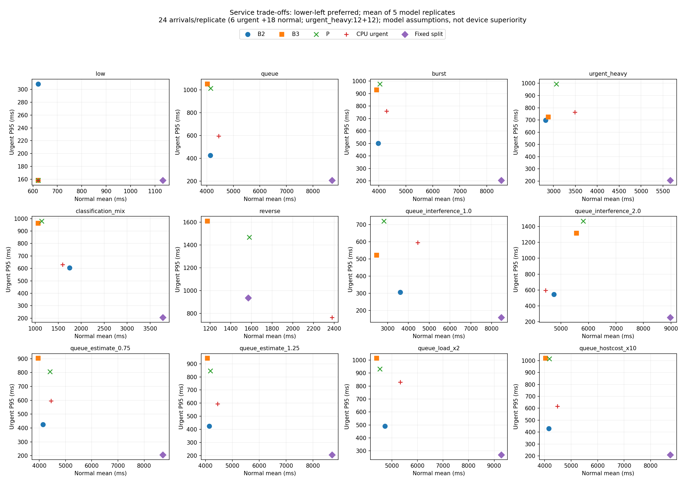
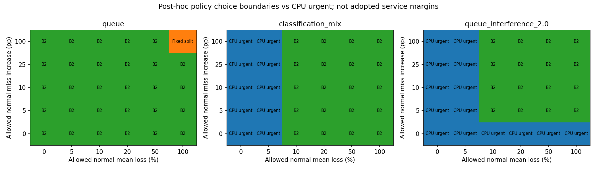

# B2·B3·P 서비스 성능 검토 — ARRIVAL-SERVICE-REVIEW-01

2026-09-25. 시작 branch `feature/arrival-scheduling-20260923`, HEAD `7402a0a6973ad19148be3ee3d406eb282e8410b2`, clean·원격 일치. 기존 탐색 v3의 사후 분석이며 **추가 실측·전체 배치·정책 튜닝은 하지 않았다.** 기존 독립 평가 FAIL, fixed-split 부분 결과, 40개 동결값·20개 null·종료 계획·`experiment_ready=false`를 보존한다.

**결론: B2는 강한 기준이지만 일반 서비스까지 항상 우세하지는 않다. 현재 P 튜닝은 보류하고, 서비스 제약을 명시한 제한적 정책 선택 문제로 정리하는 방향을 권고한다.** 프로젝트 목표 변경과 허용 손실 수치는 아직 채택하지 않는다. 적응형 정책 개발을 계속하려면 먼저 단순 정책으로 충족하지 못하는 서비스 조건이 있어야 한다.

## 자료와 계산의 공정성

기존 [실행·탐색 보고서](ARRIVAL_FOLLOWUP_AND_EXPLORATION_20260925.md), [PLAN](PROJECT_PLAN.md), [DECISIONS](DECISIONS.md), [엔진](../tools/d1_arrival_explore.py)의 `choose/simulate`, [배치](../tools/d1_arrival_explore_batch.py)의 `workload/run` 및 보존된 freeze/CSV/receipt/대표 trace를 대조했다. 새 [후처리](../tools/d1_arrival_service_review.py)는 기존 960행과 해시를 검사하고 계산한다.

| 확인 항목 | 확인 결과·제한 |
|---|---|
| B2 후보 | 분류/탐지 CPU·GPU 배정 4조합×직렬/병행. explore 8후보, strict 4직렬후보. 개별 backend 지원과 임의 병행 성능 검증은 다름 |
| 개발 선정 | low/queue/burst, seed101~103, 반복당20요청. 모든 개발 실행 완료, 조건별 평균 일반 응답≤CPU 긴급우선, 일반 기한 내 비율≥CPU 긴급우선인 후보만 허용 |
| 목적·동률 | 후보의 평균 긴급 위반율→긴급P95→일반평균→makespan→후보ID 순서로 최소화. 일반 손실0은 PC 선정 관례이고 사용자 합의 비열등성 margin이 아님 |
| 고정 시점 | `freeze_before_evaluation.json`에 개발 선정 후 평가 전에 저장. 평가 시나리오별 재선정 없음. explore는 **분류GPU/탐지CPU 병행**, strict는CPU/CPU직렬 |
| 자원 | explore B2/B3/P 모두CPU/GPU, lane당1·최대2·비선점. strict는 전체직렬이고 B3/P CPU fallback. fallback 결과는 적응형 성능 근거가 아님 |
| 순서·선택 차이 | B2/B3/P 공통 urgent/EDF/aging4초. B2는 가용 backend에 갈 후순위 요청을 찾고, B3/P는 선두 후보의 예상 이득을 보고 기다릴 수 있음. CPU 긴급우선은 같은 priority에서FIFO·aging없음. 차이를 숨기지 않음 |
| 시간 비용 | 판단/기록/dispatch 각각0.1ms, 고비용 조건 각각1ms를 모든 정책에 동일 적용. P 점수의 간섭 penalty는 실제 시간에 추가 청구하는 항이 아님. 실제 Android P 계산 비용은 미측정 |
| 정보·실현값 | 같은 요청·도착·입력벡터, seed/request/backend 식별자로 실현 벡터 고정. 정책은 도착한 큐·관측 lane단계·개발 예상값만 사용. 미래 도착·실제 미래 완료에 접근하지 않음. 다른 배정/overlap의 종료시각까지 같게 만드는 것은 아님 |
| 지원 한계 | 단독 CAL-03 개발 벡터 기반. 임의 부하 이전·역방향 병행은 가정. 실측 후속 F는 탐지GPU+분류CPU이며 선정 B2의 반대 배정을 검증하지 않음. PLAN의 완전한 B3/P·Band 재현 아님 |
| 수정 필요성 | 기존 지표/동결 선정의 구체적 오류 없음. 불리한 결과를 수정하지 않음. 새 후처리 v1의 제거군 trace 이름만 v2에서 수정(원 trace의 내부 policy 이름과 파일의 제거군 ID 구분), 수치·원 결과 불변 |

일반 서비스 허용 손실·목적은 현재 PLAN에서 미확정이다. 기존198요청 평가의10% 최소효과 등 동결 조건은 그 실험에 보존하며 이번 PC 정책 선택 기준으로 소급 변경·전용하지 않는다.

## 지표·분모·집계

- urgent: 예정 도착→output_ready, normal: 예정 도착→persist_complete. makespan은 **첫 예정 도착→마지막 실제 lane_available**, throughput은24/makespan이다. 응답 종료와 자원 해제를 혼동하지 않는다. 초기화·warmup은 이 resident 요청 처리 구간 밖이다.
- 긴급 deadline1500ms·일반6000ms는 기존 시나리오 값이며 UX SLA가 아니다. 위반 분모는 해당 priority의 전체 planned 요청이다. 정상 완료와 늦은 성공을 구분한다.
- 조건·정책별5모델반복, 각24요청. 총분모120(urgent30/normal90; urgent_heavy는60/60). 모든960실행에서 planned=arrived=response_ready=완료24, 미도착·미완료0. **실패·거절·강제 만료 과정 자체는 미모델링**이므로 시뮬레이션0을 실기기 실패율0으로 해석하지 않는다. 지연에서 누락된 미완료는 이번 결과에 없다.
- 긴급 nearest-rank P95는 반복별6건(urgent_heavy12건)의 **최댓값**을 구한 뒤5개 평균이다. pooling P95·모집단tail·실측 세션 CI가 아니다. 일반평균도 반복별 계산 후 평균. 일반P95는 전체 배치에 미저장되어 미산출이며, 기존/최소 재생 trace에서만 별도 제공한다.
- 절대값은 반복 평균, 상대차는 동일seed의 `(정책−대조)/대조`를 동일 가중 평균한다. 평균의 비율로 대체하지 않는다. 처리량도 반복별24/makespan의 평균이다. CSV min/max는5모델반복의 관측 범위이고 CI가 아니다. 여러 조건을 한 모집단처럼 합치지 않는다.

## 같은 조건의 서비스 결과

**기본 queue/explore**: 정책별120/120완료·실패과정 미모델링·미완료0. 긴급 위반은 모두0/30이다.

| 정책 | 긴급 P95 ms | 일반 평균 ms | 일반 위반/90 | 일반 기한 내 % | makespan s | 처리량 req/s |
|---|---:|---:|---:|---:|---:|---:|
| CPU 긴급우선 | 595.49 | 4446.92 | 26 | 71.11 | 12.302 | 1.951 |
| 고정 urgentCPU/normalGPU | 206.91 | 8715.26 | 60 | 33.33 | 20.719 | 1.158 |
| 선정 B2 | 425.89 | 4138.67 | 20 | 77.78 | 11.875 | 2.021 |
| B3 | 1053.75 | 4024.27 | 17 | 81.11 | 11.277 | 2.128 |
| P | 1014.02 | 4150.55 | 17 | 81.11 | 11.816 | 2.031 |

P/B3는 긴급−4.11%, 일반+3.14%; P/B2는 긴급+138.03%, 일반+0.29%다. **B2는 긴급 지연이 크게 유리하고 일반평균도12ms 작지만, 일반 위반은3/90건 더 많다.** 긴급 위반0은 정책 우수성의 근거가 아니다. 이 조건에서 B2와P의 두 지연 평균만 보면 B2가 우세하지만 위반율을 포함하면 상충이다.

[모든12조건×5정책 절대값·분모와 P/B2·P/B3 상대차 표](results/arrival_service_review_20260925/service_tables.md), [전체8정책×2모드 CSV](results/arrival_service_review_20260925/absolute.csv), [상대차 CSV](results/arrival_service_review_20260925/relative.csv)를 제공한다. 대표 조건만으로 결론을 대신하지 않는다.



점은5모델반복 평균, uncertainty CI는 미산출; 범위는CSV에 있다. low에서 B3/P/CPU 점이 겹친다. 직렬 strict 결과는CSV에 별도 보존하며 위 그림과 합치지 않는다.

12조건의 평균 긴급P95·일반평균만 비교하면 B2 우세8, P 우세1(low의 일반평균은 동률), 상충3이다. 긴급/일반 기한 위반율도 포함하면 **B2 우세5, P 우세1, 상충6**이다. [조건별 지배 표](results/arrival_service_review_20260925/dominance.csv)의 우세는 이 모델 표본의 약한 Pareto 지배이며 일반적 정책 지배나 통계적 우월성 판정이 아니다. 기본queue에서도5반복 중B2 두지연 우세2·상충3으로, 집계 순서에 따라 세부 관계가 달라진다.

- low: B2 긴급308.60ms, B3/P158.37ms; 일반621.71ms로 같다. 적응형 추가기여 없이CPU 긴급우선도 같은 성능이다.
- classification_mix: B2 긴급603.77ms/일반1747.67ms, P979.54/1138.50ms. B2의 긴급 이득과 일반 손해가 상충한다.
- 실제 간섭을1로 둔 가정: B2 긴급305.69ms/일반3600.06ms/일반위반11/90; P720.91/2816.50ms/위반0. P/B3는 긴급+45.85%·일반+14.17%로 둘 다 손해다.
- 실제 간섭2 가정: B2 일반4744.04ms·위반30/90, P5807.71ms·48/90. B2가P보다 유리해도 CPU 긴급우선 대비 일반평균+6.68%·위반+4.44%p여서 개발 선정 제약을 평가 조건 전체에서 보장하지 않는다.

## 일반 서비스 제약의 선택 경계 — 사후 탐색, 채택 아님

기준정책은 **동일 조건 CPU_URGENT**. `ε`는 일반평균 허용증가%, `δ`는 일반 기한 위반율 허용증가%p다. 전체완료를 요구한 후 두제약을 함께 적용하고, 가용 후보 중 긴급 위반→긴급P95→일반평균→ID 순서로 비교한다. 이는 기존 결과의 선택 경계 설명용이며 성공 기준·B2 재선정·P 튜닝이 아니다.

| 조건·정책 | 필요한 ε 최소 % | 필요한 δ 최소 %p |
|---|---:|---:|
| queue B2 | −6.932 | −6.667 |
| queue B3 | −9.504 | −10.000 |
| queue P | −6.665 | −10.000 |
| classification_mix B2 | +9.504 | 0 |
| classification_mix B3 | −33.284 | 0 |
| classification_mix P | −28.665 | 0 |
| interference2 B2 | +6.681 | +4.444 |
| interference2 B3 | +25.096 | +15.556 |
| interference2 P | +30.601 | +24.444 |

음수는 기준보다 이미 나음을 뜻한다. 기본queue의 ε=δ=0에서는 B2/B3/P 모두 가능하고 긴급 목적상B2가 선택된다. 그러나 기준을B3로 바꾸어 일반 위반 증가를0으로 제한하면 B2의+3.333%p가 허용되지 않는다. **기준정책·서비스 목적의 선택 자체가 연구 판단**이다. 미확정 margin을 결과에 유리하게 채택하지 않는다.



[연속 경계 수치](results/arrival_service_review_20260925/constraint_boundaries.csv)와 [예시 격자](results/arrival_service_review_20260925/sensitivity.csv)는 각각 제공한다. 격자 범위는 실측 분포나 신뢰구간이 아니다. 현재 결과에 맞춘 사후 비교이므로 새독립검증으로 부르지 않는다.

## P가 불리한 이유 — 결정과 결과의 분리

대표 선정 규칙: 기존 대표인queue/explore/최소seed201을 그대로 사용한다. 추가로 기존12조건에서 P/B3 긴급 상대손실 평균이 가장 큰 `queue_interference_1.0`과 최소seed201을 선택해 B2/B3/P **3개 trace만** 재생했다. 기존CSV의 모든지표와 일치했다. 각 trace에서 P와 B3가 같은 관측상태에 서로 다른 선택을 하는 최초2호출을 추출했다. [결정 입력·후보](results/arrival_service_review_20260925/decision_cases.json), [trace 요약](results/arrival_service_review_20260925/trace_summary.csv). 아래 시간은 동일 시뮬레이션 monotonic축이다.

1. **예상 간섭 때문에 유휴GPU를 두고 기다림.** queue의200ms, 요청 `evaluation/queue/1`(긴급분류), CPU는일반요청0 실행중·GPU가용. CPU예상잔여427.718ms, CPU응답점수582.435ms. GPU단독응답295.764ms에 가정간섭비용332.692ms를 더해628.456ms가 된다. P는CPU를 기다리고 같은상태의B3는GPU를 선택한다. 이후 P 실제dispatch629.848ms·도착부터응답854.303ms, 별도로 실행된B2는dispatch200.300ms·응답424.755ms였다. 같은상태 B3의 가상선택에 후자의 실제시간을 붙이지 않는다.
2. **B2와P의 차이는 단순히 느린GPU 선택이 아니다.** 같은 반복에서 둘다긴급6/6GPU지만, B2 긴급대기평균0.300ms/P266.420ms이고 dispatch이후응답은396.461/402.478ms다. B2는이작업구성에서GPU를긴급분류에 남기고 탐지를CPU에 배정하는 반면 P는일반4건도GPU에 배정한다. P의대기·일반작업과의점유·간섭점수에 따른순서변화가 관측손실을 설명한다. 일반평균은 이반복에서B2 4188.833/P4154.388ms로 P가더작다. 유리한반복만전체결론으로 쓰지 않는다.
3. **간섭 예상과 실현 가정의 불일치가 손해인 반례.** `queue_interference_1.0`에서도 P의예측계수는1.5다. 같은최초상태에서간섭penalty로 기다리지만 엔진실현에는감속이없다. seed201 긴급대기평균B3 174.085/P382.651ms, 긴급P95 725.314/867.945ms. 이실행의unknown-pair대기0이므로 여기의손실을UNKNOWN_OVERRUN탓으로 돌릴수없다. 미측정간섭가정의반례이지 실제기기의간섭효과 추정이아니다.

기본queue P에는 `UNKNOWN_OVERRUN` 상대비용미확정으로선택하지않은6호출이있다. busy lane을실제callback전에풀지않는정상규칙이며 임의0으로바꿀근거가없다. 호출수만으로총지연기여를계산할수없다. 일반미완료0으로이번120초범위의무한기아는관측되지않았지만 긴일반대기와deadline위반은있다. 일반적기아부재증명은아니다.

기본대표의P 판단+기록총예산30.0ms/dispatch2.4ms, B3 29.4/2.4ms, B2 30.8/2.4ms다. 이는가정비용의전체호출합계이며 개별응답critical path 기여량이아니다. 수백ms대대기손실을P에만붙인계산비용으로설명할근거는없다. 고비용10배조건도별도표에보존한다.

간섭비용을제거한P는B3와동일결정·동일결과다. 병행금지제거군은자원사용과큐를함께바꾸므로간섭점수만의인과효과가아니다. 현재 P의 추가항은근거없는k=1.5가정에의존하며, 이번결과는이를더튜닝할성능근거를주지않는다. 열·에너지·실제GPU장치원인·Android동작에대한새판정은없다.

## 배터리20% 근거의 한정

이번 대화에서 접근 가능한 사용자 원문은 **“실측 시작할때 휴대폰 배터리 20%이상이면 그냥 진행해”**다. 따라서 **시작 gate20%의 명시적 승인 근거는 확인된다.** 이를 승인기록이 없는 것으로 보고하지 않는다. 반면 실행 중 하한까지30→20으로 바꾸라는 별도 명시적 지시는 확인되지 않는다. 그것은 당시 구현 해석으로 구분하며 사용자 문구가 실행 중 하한도 직접 지정했다고 쓰지 않는다.

보존된 `confirmation_followup_plan_v3`는시작55/실행중30, 미소비상태에서개정된v4는둘다20이다. v4 amendment에이전값과사용자지시가이유로있지만 계획주석자체를독립승인으로취급하지않는다. 실행 receipt의계획hash는 `365e16cf8a811e17b0b7c83f7b1fbd34ef87a58dc76d561f9f46e3b2e07d4bd0`이다.

실제시작52%는종전시작55%를충족하지않았다. 세션별사전51%,각세션앱환경기록도51%이므로 **관측된실행중값은종전30%이상**이었다. 미관측시점을포함한연속준수는단정하지않는다. 실행중하한변경으로실제로허용된저배터리표본은관측되지않았으나, 날짜·환경·시작허용범위가달라진후속자료를원래동일기간완주로합치지않는다. 원본·계획·승인기록을새로만들거나고치지않았다.

## 권고와 남은 결정

세 방향 중 **서비스 상충을 명시한 제한적 정책 선택 문제로 정리**하는 방향을 권고한다. P를최종승자로만들기위한새튜닝·정책추가·실측확대는보류한다. 강한정적B2와CPU긴급우선(필요시B3)의제약충족범위를먼저정리하고, 고정규칙으로충족할수없는조건이실제요구일때만적응형기여를다시검토한다. B2의임의병행과실제최적성이미검증이므로“정적정책의보편적우월성”으로연구를종료하는것도성급하다.

**다음 사용자 결정 한 가지:** CPU 긴급우선 대비 일반 기한 위반율 증가를 허용할 것인가. 권장 논의 출발점은 이를 주서비스제약으로두는 것이지만, 0%p 등수치는이번결과만으로채택하지않는다. 평균지연허용손실과함께요구사항을평가전에고정해야한다. 본권고는목표변경안이며기존최종목표를자동교체하지않는다.

현재 `experiment_ready=false`: 일반서비스목적·margin, 실제Android B3/P, 선정B2의역방향병행지원/예측범위, 새정책paired변동성·독립평가예산, 기존시스템대조가미충족이다. CSV/PC실행가능과실기기정책평가준비는다르다. 이번에는 추가 측정을 제안하거나 실행하지 않는다.

## 산출물·재현·검증

[결과 묶음과 파일 설명](results/arrival_service_review_20260925/README.md). 외부 원자료 root는 `C:/Users/LG/Documents/D1Check_Arrival_Extension/`이며 GitHub에 포함되지 않는다. 입력은 `arrival_explore_batch_v3`(원960행·개발선정·동결·대표trace), `confirmation_followup_execution_v1/FINAL_RECEIPT.json` 및 연결된v3/v4계획·실측기록이다. 새산출은 `arrival_service_review_v2`, 최초후처리v1도보존했다.

```powershell
python -B -m unittest tools.test_d1_arrival_service_review -v
python -B -m tools.d1_arrival_service_review --source C:/Users/LG/Documents/D1Check_Arrival_Extension/arrival_explore_batch_v3 --bundle docs/results/arrival_explore_20260925/input_bundle --output C:/Users/LG/Documents/D1Check_Arrival_Extension/arrival_service_review_reproduced_v1
```

두번째명령은새출력만허용하며 기존960행재집계와대표3개PC재생만수행한다. 개발B2선정·전체배치·ADB를실행하지않는다. 외부원자료접근권한이필요하다. 공유된CSV/그림은추가실행없이바로읽을수있다.

검증: 신규후처리5테스트(동일seed상대차, 누락pair거절, deadline포함지배, 두서비스제약/완료필수, nearest-rank/경계/제거군ID)통과. 대표3개재생의모든기존지표일치. 시뮬레이터·배치·기존수치변경없음, 전체테스트/Gradle/ADB없음. PNG두장직접검토, SVG동일도표제공. 검증대상sourcehash·명령·시점은 [VERIFICATION](results/arrival_service_review_20260925/VERIFICATION.json)에기록했다. 정책성능PASS·기기신뢰구간을부여하지않는다.
