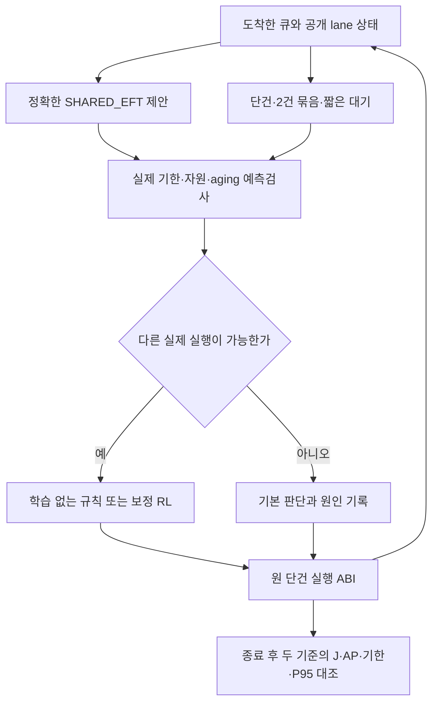

# 실제 기한 여유를 사용하는 보정 RL 재설계

2026-10-08 KST · `SLACK-RESIDUAL-DESIGN-01`

**설계를 완료했다. 정책 구현·성능 pilot·학습은 아직 시작하지 않았다.** 사용자가 승인한 작업은 이번 재설계이며, 아래 후속 실행 숫자는 기존 잔여 예산 안의 제안 배분이다. 설계 문서가 실행 허가나 정책 채택을 대신하지 않는다. 기존 결과·물리 계수·기본 정책·strict 지원·`experiment_ready=false`를 유지한다.

새 방향은 **SHARED_EFT의 실제 기본 동작을 유지하면서, 실제 기한 안에서 배정·허용 병행·짧은 대기를 보정하는 정책**이다. 선택지가 적은 기존 예약 계획에 PPO를 다시 붙이는 방법은 채택하지 않는다. 선택지 확대가 서비스나 비용 개선을 보장하지 않으므로, 학습 없는 prototype에서 실제 실행 차이와 개선 신호를 먼저 검사한다.

## 1. 확인한 원인과 아직 확인하지 못한 것

완료된 R2 192조건의 후보 기록만 읽었다. 엔진·learner를 import하거나 호출하지 않은 분석이며, 원본은 변경하지 않았다. [분석 계약](results/slack_residual_design_01/audit_manifest.json)·[전체192행](results/slack_residual_design_01/constraint_audit.csv)·[집계](results/slack_residual_design_01/constraint_audit.json).

| 기존 기록에서 확인한 항목 | 값 | 해석 |
|---|---:|---|
| 실제 기한보다 이른 cap |12,403/12,672요청|예약이 대부분의 실제 서비스 여유를 추가로 제한했다|
| 실제 기한−cap 평균 |2.985764초|사용하지 못한 선언상 여유; 안전하게 쓸 수 있는 여유 보장은 아님|
| cap 검사만으로 탈락한 후보 |579,528개|예약 검사와 실제 기한 검사를 분리할 이유가 있음|
| 실제 기록의 다중 반환행동 callback |1,112/53,209|WAIT 반환 차이를 포함하며 실제 실행 차이와 같지 않음|
| cap 라벨을 제외하면 추가 즉시 DISPATCH가 나타나는 callback |6,776|새 실제 기한/aging/lane 검사로 재검증해야 하는 후보군|
| cap 라벨 제외 후 다중 반환행동 callback |25,213|새 적격 행동 수라고 부를 수 없음|
| 국소 J 검사만 제외 후 다중 반환행동 callback |1,119|이 기록에서 예약 제약의 영향이 더 큼|

R2 cap은 `min(원래 기한, 처음 long-context EFT 예상 응답시각)`이다. 제거할 대상은 **처음 예상 응답시각을 계속 강제하는 추가 제약**이며, 원래 1.5/6초 기한이 아니다. 기록에는 모든 후보의 guard 응답시각이 남아 있지 않아 cap 탈락이 실제 기한 위반인지까지 이번 읽기 분석으로 인증할 수 없다. cap을 지우면 대안이 안전해진다는 결론도 내리지 않는다.

이미 본192조건을 이 설계의 진단에 사용했으므로, 그 조건은 새 설계의 미열람 최종시험으로 재사용하지 않는다. 원 최종 판정과 CSV는 그대로 보존한다.

## 2. 기존 작은 공동 이득을 teacher로 쓰지 않는 이유

[저장 일정](results/method_followup_01/joint_calendar_v1/results.csv)과 [처리문맥 전이](results/method_followup_01/joint_calendar_transfer_v1/results.csv)를 다시 대조했다. mean의 두 고정 일정은 기한을 모두 지키며 J−0.052468/−0.013042, AP−0.049803/−0.045679°C였지만 **긴급P95가 +686.803/+776.264ms** 증가했다. short/long 네 전이도 +671.357–+789.612ms다.

따라서 이 여섯 계산은 **긴급P95 비악화까지 요구하는 이번 목표의 적격 teacher가 아니다.** 미래 입력을 알았고, 해당 목적의 최적성도 미입증이다. 행동의 시간배치 참고로만 사용하며 behavior cloning의 성공 라벨로 넣지 않는다.

[완화 상한](results/method_followup_01/joint_bound_v2/bounds.csv)은 옛48요청·다른 입력에서 queue50의 낙관적 J 이득이0.120068–0.178390J였다. lane packing과 일부 물리 입력을 완화했고 AP면적 제약도 포함한다. 새24/192요청·Band 대조·원래 긴급P95 제약의 상한으로 전용하지 않는다. 양의 상한은 달성 가능한 일정이나 큰 실기기 효과의 증명이 아니다.

## 3. 세 대안의 선택

| 대안 | 장점 | 문제 | 선택 |
|---|---|---|---|
| R2 제약 그대로 PPO 추가 |기존 코드 변경이 작음|첫 요청/backend 선택이 한 가지였던 구조를 유지함|기각|
| 실제 기한 안의 모든 단건 행동을 원시 PPO로 선택 |선택 폭 증가|기존17행동 PPO와 차이가 작고, 긴급/에너지 상충을 학습량으로 해결할 근거 부족|단독 방향으로 기각|
| 정확한 SHARED_EFT + 허용된 2건 배정/단건/대기의 보정 + 전체 에피소드 제약 |명확한 기본 정책·원인 분리·유효한 행동 묶음·전역 비용 학습|prototype에서 선택지와 개선 신호를 다시 확인해야 함|이번 재설계의 선택|

Band는 독립된 비교 정책으로 유지한다. Band의 HEFT·FIFO·EMA를 임의로 바꾸어 새 정책에 Band 이름을 붙이지 않는다. 기본 정책은 `tools/d1_queue_ppo.py`의 `Controller(variant='SHARED_EFT')`를 그대로 사용한다. R2의 내부 `EFT_REFERENCE`가 SHARED_EFT와 다르다는 발견을 반영한 선택이다.

## 4. 유지·삭제·추가

| 항목 | 새 정책의 의미 |
|---|---|
| 원 기한 |urgent의 OUTPUT_READY까지1.5초, normal의 PERSISTED까지6초 그대로|
| 전체 완료 |원래 요청 전량·관측창120초 유지, 삭제/만료/거절로 이득 만들지 않음|
| 추가 예약 cap |새 정책에는 넣지 않음. R2 코드/장부/판정은 변경하지 않음|
| signed arrival J budget |새 정책의 행동 veto로 사용하지 않음. 반복마다 새 J 예산을 만드는 대체안도 사용하지 않음|
| J 목표 |전체 에피소드의 정확한 대조 비용과 검증 제약으로 처리|
| 긴급P95 보호 |실제 원 기한과 별도의 전역 지표임. 학습 제약·동결 정책 검증에서 비악화 요구 유지|
| 자원/실행 단위 |A24 분류CPU/GPU·탐지CPU·CG_DC만, 전체 요청 비선점·최대2건|
| 계산 근거 |원모형5682082a…·초기값·서비스3문맥·에너지/열 계산 그대로|
| 지원하지 않는 것 |NPU·탐지GPU 비용·DVFS·선점·정밀도/품질 변경·표면온도·열→속도 법칙|

## 5. 행동 공간과 실행 ABI

새 정책 ID는 `SHARED_EFT_SLACK_RESIDUAL_PPO_V1`, 학습 없는 대조는 `SLACK_FEASIBILITY_PRIOR_V1`와 `SLACK_GREEDY_RULE_V1`로 제안한다. 이름이 외부 시스템 전체 재현이나 우월성을 뜻하지 않는다.

기본 정책의 기존 정렬·`age_limit()`·강제 aging 요청을 그대로 읽는다. 후보 요청은 기본 코드가 반환한 최대8개다. 기존 urgent/normal 순서와 강제 aging을 조용히 바꾸지 않는다.

| 행동 | 조건 | 실제 제어 |
|---|---|---|
| 기본 선택 |정확한 SHARED_EFT의 제안|단건 DISPATCH 또는 필수 사건 대기|
| 단건 배정 |현재 도착한8후보의 지원 backend가 실제 available|요청1건의CPU/GPU 배정|
| 2건 배정 묶음 |두lane 실제available, 서로 다른 분류GPU+탐지CPU, 강제aging 포함|같은 물리시각에 두 요청을 순서 있게 확정|
| 짧은 자발 대기 |지금 dispatch 가능·강제aging 없음·기존age_limit 내·예측서비스 통과|최대0.25초, aging 경계가 빠르면 더 짧게|
| 필수 사건 대기 |실제lane busy/관측 overrun 등|기본 정책 그대로. 자발 선택지로 노출하지 않음|

8후보에서 분류를c개라 하면 단건은8+c개, 묶음은c(8−c)개다. 합계 최대28이며 기본제안·timer를 더해30개 이하, 출력을32slot으로 padding한다. 중복을 제거하고 미래의 조합 확장으로slot을 늘리지 않는다.

묶음 때문에 원 engine ABI를 변경하지 않는다. provider는 매번 `selected={request_id,backend}` 한 개만 반환한다. 첫 번째를 실행한 뒤 pending 두 번째를 다음 같은시각 callback에 반환한다. 강제aging 요청이 있으면 먼저 실행하고, 없으면 CPU→GPU 순서다. 두 번째 실행 전에 **같은now, 첫 요청의 실제점유, 둘째 요청의도착/큐존재, 둘째lane의실제available, 지원 조합**을 재검사한다. 달라졌으면 묶음을 취소·기록하고 다시 판단한다. 예측시각으로 lane을 해제하지 않는다.

묶음과 기본 정책이 같은 두 요청을 같은시각에 실행하면 새 물리 행동이 아니다. prototype은 첫 양의 시간진행 전의 실제 `dispatch set`과 다음 공개 사건의점유 상태를 비교해 중복을 검출해야 한다. WAIT 시각만 달라도 중간 사건이 먼저 깨우면 같은 실행 결과일 수 있다.

## 6. 실제 기한 필터와 정확한 기준 후속계획

매 결정에서 현재까지 도착한 요청만Q에 넣는다. 관측lane 상태는 `request/phase/since/dispatch`뿐이고, 실제미래경과시간·다음요청·seed/family/실현context를 읽지 않는다.

각행동 a 뒤의 Q 전체를 기본 SHARED_EFT로 계속 처리하는 **순수 예측 event rollout**을3개 문맥κ에서 계산한다. 앞으로 새로 시작할 요청의 예측 plant는 κ의 5단계 시간을 사용하지만, 기본 정책의 추정값/aging 로직은 원래 mean 설정 그대로다. 이미 실행 중인 요청의 과거를 short 문맥으로 다시 줄이지 않는다. 진행 중 작업은 원 `active_jobs()`의 mean 잔여를 mean/short 미래경로에, long 잔여를 long 미래경로에 사용한다. 둘 중 하나라도 관측 overrun으로 계산 불가면 보정을 중단하고 원 기본 판단을 따른다. 이는 관측한 과거를 고정하고 앞으로 시작하는 작업의 비용만 변화시키는 조건부 스트레스 예측이며 전체 에피소드가 그 κ였다는 주장이 아니다. κ에 맞춰 기준 정책의추정값을 바꾸면 동일 기본 정책의 예측이 아니므로 금지한다. deepcopy한 예측 상태를 사용하며 실제 provider의heap/EMA/RNG/관측 상태를 소모하지 않는다.

예측은 지금의 후보를 평가하는 모델 계산이다. 원engine의 `simulate()`를 호출하지 않으며 별도projection 횟수/벽시계 비용으로 기록한다. 예측lane반환은 예측 안에서만 사용한다.

각 q의 실제 마감 Dq=arrival+deadline_offset를 사용한다. 편의상 관측된응답 완료는 미래위반으로 다시 계산하지 않는다. 새보정행동의mask는 다음을 모두 요구한다.

1. 실제lane available·지원 조합·중복ID 없음·aging/대기 한도 준수.
2. 세 예측문맥 모두 현재Q의 urgent OUTPUT_READY/normal PERSISTED가 Dq 이내.
3. 세 문맥 모두 현재Q의 마지막 실제lane반환 예측이120초 이내.
4. 비용/응답 예측은유한하고 지원된계수만사용. null/미지원 비용을0으로채우지 않음.

기본행동이 위 예측검사를 실패하고 다른행동이 통과하면 기본행동을학습선택에서제외한다. 모든행동이실패/예측불가면 **기본정책 강제 fallback 한 개**를 반환하고 원인·예측서비스 실패를 기록한다. 이를 적격/기한보장으로 표시하지 않는다. 비용의기준 rollout이계산불가면 보정을중단하고 기본정책을따른다.

이 필터는 **도착한Q의모형상검사**다. 미래도착·실현오차·전체P95·전체J 비악화를 보장하지 않는다. 같은callback에서 ‘기준보다먼저완료’ 또는 ‘현재Q의P95가더짧음’을 추가 hard cap으로 넣지 않는다. 이를 넣으면 새정책이 다시이른EFT예약에갇힐수있다. 대신 아래전역제약과최종검증을유지한다.

## 7. J·AP를 시간배치와 분리해 관측

현재입력과공통창에서 에너지는 `J = P_idle·120 + Σ_s W_inc(s)·duration(s)`다. s는분류CPU·분류GPU·탐지CPU·분류GPU+탐지CPU의4지원상태다. 같은 상태 점유시간이면 현재 모형의 J도 같다. 그러나 CPU/GPU 배정이나병행시간이달라지면 J도달라진다. GPU건수만으로에너지절감을예측하지 않는다.

후보특징에 각문맥의4상태 점유시간, 기본계획대비ΔJ/ΔAP, 실제마감여유를넣는다. RL은AP를낮추는대기가유리한지, 겹침을깨서J를늘리는대기인지 구분할수있게한다. 이기능은초기예약만표현하던설계와다르다. 온도점수와비용을임의가중치로합쳐정책우월성을판정하지 않는다.

구체적으로 검토할 보정은 두 가지다. 일반 작업을 조금 분산하되 유리한 CG_DC 병행량을 잃지 않는 선택, 그리고 현재 모형 온도가 이미 관측한 최고값보다 낮을 때 병행을 활용해 J를 줄이는 선택이다. ‘전체 열 피크가 이미 지나갔다’는 미래 정보를 가정하지 않는다. 후속 도착으로 다시 최고값이 생길 수 있으므로 둘 다 prototype에서 검증할 가설이다.

예측·학습보상·최종KPI는모두 기존 **AP35–180초1초격자**의최고값으로맞춘다. 전이경계의AP는보조진단이며KPI최고값에조용히추가하지 않는다. AP는표면온도가아니다.

시간 이동이 단지 1초 표본 사이로 최고값을 옮기는지도 보조 진단한다. 전이 경계의 추가 표본 최고값과 AP면적은 별도 열에 보존하고 기존 KPI를 조용히 바꾸지 않는다. 격자 최고값만 감소하고 추가 표본의 최고값이 증가하는 경우는 ‘격자 정렬에 민감한 이득’으로 표시해 실기기 열 개선 근거로 사용하지 않는다.

## 8. 관측·신경망 설계

[기계 판독 schema](results/slack_residual_design_01/design_contract.json)의이름/차원/단위를기준으로한다. 구현전최종검토에서고정할제안값이며, 차원이맞는다는이유로옛85관측actor를로드하지 않는다.

- state107: 시간/누적모형비용/모형T·h·현재까지격자최고값/현재큐통계15, 관측한 응답 통계6, 공개lane특징11×2, 현재요청특징8×8.
- candidate61: 의미행동/provenance5, 최대2요청특징9×2, timer2, 문맥별예측특징8×3, 지원상태점유시간4×3.
- 관측 응답 통계6개는 이미 공개된 urgent OUTPUT_READY/normal PERSISTED의 건수·기한 실패·긴급 P95와 valid bit다. ID로중복을제거하고공개사건에서만갱신한다. private 최종 ledger를온라인에읽지않는다. 현재까지P95와현재Q의예측을분리하며전체미래P95라고부르지않는다.

- 실제요청ID는실행binding과정렬에만쓰며NN특징에넣지않는다. future count/arrival·실현context/비용·seed/family·미래baseline최종값도금지한다.
- 결측그룹/없는slot은presence/valid bit와padding을쓴다. 미지원비용계산을0으로간주하지않는다. 예측비용이결측이면보정mask가false다.
- state/candidate각각64→64 Tanh encoder, 결합128→64→1 점수, critic은heat와5제약의6head.
- 초기residual최종층0. 기본행동이적격이고m>1일때기본prior logit `log(9·(m−1))`, 다른prior0으로초기기본확률90%를만든다. m=1은확률1, actor/entropygradient 제외. 초기greedy는기본선택, 기본이mask에서제외되면적격행동중첫정규순서다.

baselineprior는 학습 시작용 제안이다. 모델지원/의미검사는prior보다우선한다.

## 9. 보상과 제약: 전체 에피소드 기준

M_k는현재까지공개사건으로계산한AP1초격자최고값이다. `r_heat,k=−(M_(k+1)−M_k)`를쓰고, 마지막결정부터180초까지의후속실행/잔열최고증가를terminal에반드시더한다. γ=1의합은 `−(M_final−M_start)`이다. 완료후계산한동일trace SHARED_EFT의M_ref−M_start를terminal상수로더하면episode heat return은 `M_ref−M_policy`가된다. baseline값은보상/critic target에만사용하고온라인입력/mask에는넣지않는다.

전체 J0–120초·요청 분모·완료된 긴급 P95로 아래 5cost를 계산한다. 제어 기본은 SHARED_EFT 하나지만 목표는 Band도 넘어서는 것이므로, 학습 후 제약은 **SHARED_EFT와 Band 두 독립 실행 대비 악화의 최대값**으로 잡는다. 두 정책의 지표를 섞어 합성된 실제 정책으로 부르지 않는다. 두 참조는 같은 입력/모형/실현 비용으로 종료한 뒤의 target에만 사용한다. 기본 정책이 Band 제약까지 이미 만족한다고 가정하지 않는다. `positive(x)=max(0,x)`이며EPS는원수치동률처리뿐이다.

| cost | 정의 | 학습목표 |
|---|---|---|
| 에너지 악화 |max(0,J_policy−J_shared−EPS,J_policy−J_band−EPS)/1J|기대값0|
| 미완료 |예정−성공완료 건수|기대값0|
| 긴급서비스악화 |max(0,urgent_fail_policy−urgent_fail_shared,urgent_fail_policy−urgent_fail_band)|기대값0|
| 일반서비스악화 |max(0,normal_fail_policy−normal_fail_shared,normal_fail_policy−normal_fail_band)|기대값0|
| 긴급P95악화 |max(0,P95_policy−P95_shared−EPS,P95_policy−P95_band−EPS)/1500ms|기대값0|

주 low/sustained에서baseline실패0이므로서비스악화0도절대기한실패0을요구한다. 과부하에서는baseline과같은실패가있을수있으며따로진단한다. 추가기한실패를AP감소로상쇄해적격정책으로채택하지않는다.

미완료 episode는 분모와 서비스 cost에 남긴다. 전체 AP180과 전량 비교 J cost는 null로 표시한다. heat/에너지 head의 value fitting과 actor 항에서 제외하되 완료/서비스 cost 학습과 실패 집계는 유지한다. 각 head에 valid mask를 두며 유효한 cost가 없는 batch의 해당 λ는 갱신하지 않는다. 이 조건부 비용 처리는 완료 cost=0과 최종 전량 검사를 함께 요구하며, 미완료를 제외한 성능 보고를 허용하지 않는다. 부분J를전체작업절감reward로사용하지않는다. P95/그룹결측도해당cost를null로표시하고완료/서비스조건을우회하지않는다.

PPO의변경은명시적이다. γ1·비할인Monte Carlo return·6critic head·재평가된같은candidate/mask의clipped policy ratio를사용한다. λ_j를각cost에사용하며 `λ_j←max(0,λ_j+0.01·batch_mean(cost_j))`로제안한다. PPO학습에서제약이늘준수된다는보장은없다. **최종 정책 적격성은 loss/λ와 독립된 조건별 엄격 검사**다. 성능실패후target/기한/허용J/허용P95를늘리지않는다.

학습없는 `SLACK_FEASIBILITY_PRIOR_V1`은같은pool/mask에서기본행동을우선한다. `SLACK_GREEDY_RULE_V1`은같은pool/mask에서현재Q기준세문맥의J비증가대안을우선해최고AP→J→기준선호→정규행동순으로선택한다. 기본이서비스mask에서제외됐고J대안이없으면서비스통과대안중가장작은J를선택하고예외를기록한다. 이국소J검사는greedy선택규칙이며RL의core mask에추가하지않는다. 그래야반복국소검사가장기선택지를다시모두닫지않는다. 두규칙모두전역비악화는검증해야한다.

## 10. 진행 gate와 중단 기준

| gate | 필수 근거 | 통과하지 못하면 |
|---|---|---|
| A 의미/구현 |real deadline·unknown overrun·lane해제·묶음취소/aging·미래suffix불변·관측응답중복제거·원기본복귀·비용null·공개 상태에서의 기준 예측 동작 일치·reward망원합·resume동일성 fixture|수정, 학습0|
| B 실제선택폭 |기본과다른물리시각dispatch/점유prefix가있고실제기한검사를통과|동일선택구조면재설계/중단|
| C 개선신호 |사전지정개발사례의규칙또는causal-prefix분기에서전량·기한·긴급P95비악화·J비증가·AP감소가있는실제모형결과|AP감소가항상J/서비스악화면RL진입하지않음|
| D 계산/계약 |prototype의환경당/최대callback/forecast비용·캐시적중, source/input/seed분리·전체장부·학습시간상한고정|시간미확정이면학습0|
| E 동결검증 |개발검증의각조건에서전체 분모·서비스·P95/J/AP 비악화를 기본/Band/강한Triton 각각에 대해 검사하고 최소 한 조건에서 AP 감소. 기본/greedy/Band/강한Triton을각각공개|추가튜닝/좋은seed선별없이보류|

B/C는raw veto라벨삭제가아니라새prototype의실행으로판정한다. 개선의실용적하한은현재null이며 임의0.1J/0.01°C합격선을만들지않는다. 수치개선만확인되면 ‘모형탐색가능’으로표시하고실기기개선/strict/PASS로승격하지않는다.

prototype는옛48개개발조건을사용하며, 저장된baseline행은입력/소스/모형이맞으면재사용한다. 기본과대안의분기는**최초복수유효물리행동시점**을사전규칙으로고르고, baseline대첫정규비baseline행동을같은trace에서실행한다. 시작과다른경로를쓴뒤잘된분기만고르지않는다. 예상forecast만좋고전체실행은나쁘면실패다.

## 11. 후속 예산 제안과 상태 보존

기존 `RESERVED-THERMAL-01`은2,241/20,000환경·학습0/6,144, 잔여17,759환경·단계2 383이다. 이번재설계/저장분석추가환경/학습/기기0. 새스레드/새설계ID로장부를초기화하지않는다.

| 조건부 후속 항목 | 실제환경 최대 | 학습episode 최대 |
|---|---:|---:|
| 학습없는prototype48+fixture/분기/오류16 |64|0|
| 신경망·상태저장 학습fixture |48|48|
| learner11·23·37 각2,032 |6,096|6,096|
| 공통2,032학습case+최대48fixture의 SHARED_EFT/Band 참조 |4,160|0|
| 검증3learner×4지점×24조건 |288|0|
| 검증5고정대조×24조건 |120|0|
| 최종15정책×새192조건 |2,880|0|
| 비학습진단/실패/복구 별도여유 |256|0|
| 제안합계 |13,912|6,144|

2,241+13,912=16,153으로 전체20,000 이내다. 여유3,847과 캐시절약분으로episode/seed/후보를자동추가하지않는다. 본학습6,096에48학습fixture를포함해**모든학습6,144**상한을지킨다. 새학습은옛PPO의정확한연장이아니다.

참조 cache는 예산의 전제다. 세 learner는 같은 사전 고정2,032case를 사용하고, 각case의 SHARED_EFT와 Band 참조를 입력·source·모형·실현cost·완료 receipt가 같은 경우만 공유한다. fixture48개의 두 참조까지 합쳐최대4,160이다. cache가 사라지거나 binding이 다르면 상한 밖의 전체 재계산/seed 추가를 하지 않고 중단한다. cached 참조의 미래 최종값은 actor/mask에 들어가지 않는다.

검증시점은512/1,024/1,536/2,032episode,8episode/update다. 최종15정책은기존10대조+동결R2+새prior규칙+새greedy규칙+RL3seed다. 평가를본뒤최우수seed만보고하지않는다. 검증5대조는SHARED_EFT/Band/강한Triton/R2/새greedy로제안한다.

prototype벽시계최대60분/마지막5분저장예약을제안한다. 학습블록시간은prototype비용확인전null이며확정없이시작하지않는다. 13,912는 시간 내 전부 수행할 수 있다는 보장이 아니다. raw예산/source/사용자승인경계는새 구현 등록에명시해야한다.

actor·6head critic·Adam·Python/NumPy/Torch CPU RNG·각λ·candidate/관측schema·8episode batch진행·data cursor·baseline cache binding·소비장부·선택상태를learner별terminalarchive로보존한다. 선택actor와최종학습weights를구분하고정상중지/재개동일성을실행전에검증한다. actor초기화나optimizer재생성으로resume를대체하지않는다. 복구 계산도 시작 전에 차감한다. 기존 소비 helper의 training_episodes=0 반환값을 새 학습 회계에 전용하지 않는다. 새 runner는 옛 start를 전부 포함하고 새 train/train_fixture/reference/validation/test의 실제 시작을 함께 읽는 장부 검사를 구현해야 한다. 원 helper와 원 journal을 덮어쓰지 않는다.

## 12. 비교·최종 판정과 측정 경계

새 최종192조건의seed는구현후모든접근가능등록/압축이력과충돌검사해고정한다. 옛192조건은이번설계에봤으므로새최종시험이아니다. warm-start/개발에옛최종자료를쓸때는소비자료라고명시한다. 입력/정책/모형/seed서명은train/validation/test로분리한다.

동일 trace·기한·시작 상태·공통 J 창·AP 격자·실현 cost로 비교한다. 주96 low/sustained는전량·절대기한·긴급P95비악화가먼저다. 과부하96은전체분모/각서비스와비용적격성을함께보존한다. 원deadline/EPS/AP안전limit없는상태를바꾸지않는다. 임의σ/margin을실측오차한도로사용하지않는다.

같은조건의`ΔAP<−EPS, ΔJ≤EPS`를모형열개선형,둘다음수면공동감소로표시한다. policy별조건/평균/최악/일반완료시간·기한위반·미완료·실제병행·hostcallback비용을보고한다. 큰AP/J평균으로개별서비스악화를상쇄하지않는다. baselineprior→greedy→RL차이를분리해새필터의효과를RL효과로귀속하지않는다.

현재제어비용0은기존PC가정이며휴대폰solver실행시간/J는미측정이다. [새이력확인](ENERGY_AP_HISTORY_FINAL_RESULTS_20261008.md)과[차분잔차](HISTORY_POLICY_ERROR_READOUT_20261008.md)는작은비용순위의실측판별근거가부족함을보인다. 서로다른부하의3.913J평균절대오차를새정책합격선으로사용하지않는다. 최고표면온도/S26/NPU/열→처리율은계산불가·미검증그대로다.

최신 [10초 관측 prefix 예측](ROLLING_FORECAST_RESULTS_20261008.md)은 AP 평균오차 개선과 최대오차 악화를 함께 확인했고, 실제 미래 일정이 주어진 조건부 평가였다. 현재 앱의 numeric AP 입력·host 실시간 전달·계측비용은 아직 검증되지 않았다. 이 설계 v1의107관측은 **MODEL_AP 모드**로 고정해 실측 AP가 있는 것처럼 넣지 않는다. 향후 관측 prefix를 사용할 경우 timestamp/after_ns/전달지연/누락을 검증하고, 후보의 예측 일정만 입력하는 별도 schema v2와 동등한 비교 입력을 등록해야 한다. 단기 AP 개선을180초 정책 예측이나 J 보정의 통과로 확대하지 않는다.

## 13. 구현 파일과 검토 순서

아래는**계획 파일명**이며실행준비완료CLI가아니다.

1. `tools/d1_slack_residual_controller.py`: 기본delegate·8pool/32slot·pendingbundle·동일예측코드·mask·107/61schema·원기본반환.
2. `tools/d1_slack_residual_study.py`: old장부연결·불변source/input·fixture/pilot소유권·실제환경사전차감·B/C/D gate·중지 저장.
3. `tools/test_d1_slack_residual_controller.py`: 의미적fixture,테스트가실제로엔진을시작하면budget필수.
4. gate통과시만 `tools/d1_slack_residual_ppo.py`: 새actor/6critics·PPO/MonteCarlo·pairedclosedreward·전체 분모·terminal archive.

새구조의프로젝트내차별점은예약cap과장기제약의분리,정확한SHARED_EFT fallback,동시dispatch묶음의확정,4상태점유시간특징,실제실행prefix중복제거,완료후대조비용과P95의별도제약이다. 앞선beam/제약PPO/Residual RL발상과겹치는부분이있으므로최초성/논문수준독창성으로주장하지않는다.

## 14. 원 논문과 적용 범위

- [Residual Reinforcement Learning for Robot Control](https://arxiv.org/abs/1812.03201): 기존제어와학습보정의역할분리참고. 연속제어신호의덧셈을우리의이산요청선택과같다고부르지않는다.
- [Proximal Policy Optimization Algorithms](https://arxiv.org/abs/1707.06347): clipped objective/여러minibatch update의출처. PPO만으로서비스/J제약을보장하지않는다.
- [Constrained Policy Optimization](https://arxiv.org/abs/1705.10528): reward와constraint를분리하는원리참고. 본안은CPO trust-region구현이나그보장재현이아니다.
- [Predictive safety filter](https://arxiv.org/abs/1812.05506): 후보/backup/예측검사의원리참고. 이프로젝트는불확실성집합/재귀적안전가정을충족했다고확인하지않았으므로안전인증이라고부르지않는다.

실제완료물은재설계문서·기계schema·기존후보원인분리192행과7읽기검증이다. 정책성능/새학습/기기검증은0이다. 다음작업은**학습없는controller prototype와gate A/B/C/D 검증**이다.
